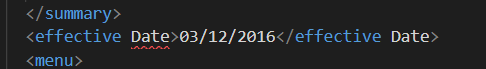
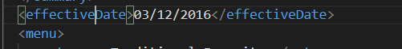
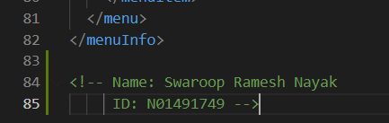
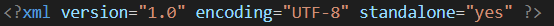
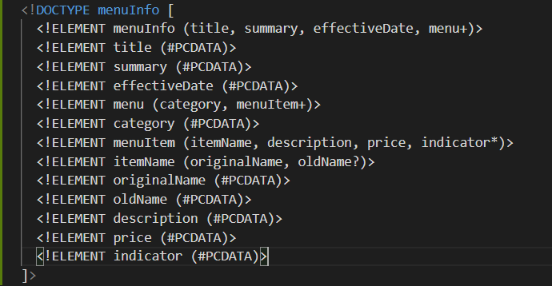
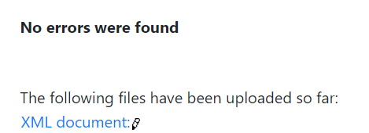
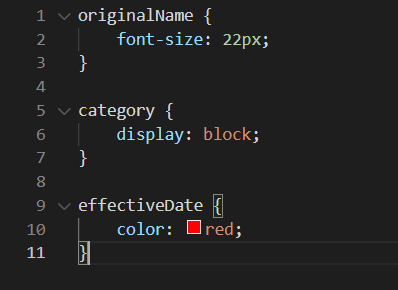

1. The tag "effective Date" tag contains a space. This was changed to "effectiveDate".

2. The cdata tag is used to parse strings which otherwise would be parsed as XML. In this case cdata contains symbols like * and %.
3. Comment added  

4. Prolog of the document is 
 
Everything inside the "menuInfo" tag is the document body. 
Epilog of the document is the comment after the root element "menuInfo"  

5. DTD for the document  

6. File is validated via an online parser 

7. CSS added  
 

