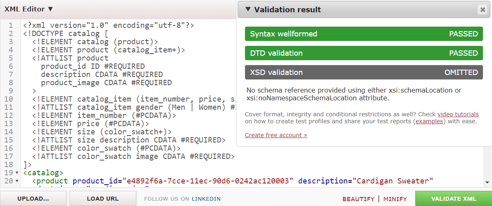
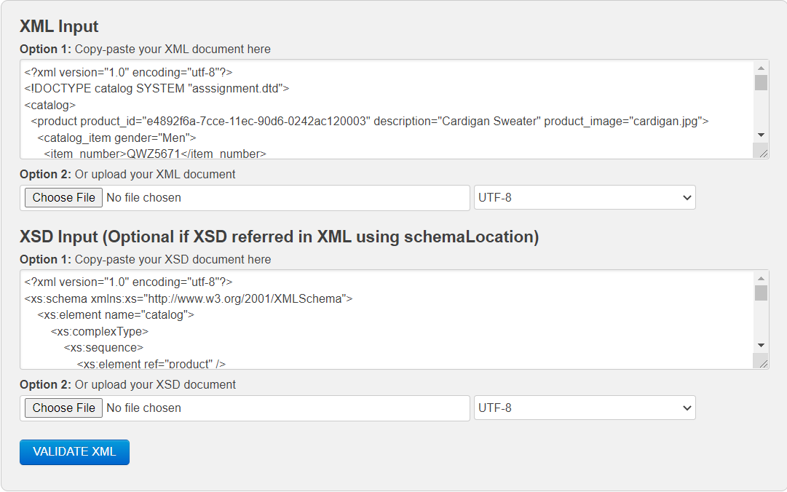

2. The DTD file was successfully validated against the XML

3. The XSD file was successfully validated against the XML

4. I first created the DTD file. I started off with the element type declarations that we had learned last week. Product, catalog_item, size and color_swatch were the only elements that had attributes. Product had 3 attributes product_id, description and product_image. All 3 were marked as required and product_id was marked as ID. The catalog_item had gender attribute which was of ennumerated type and the attribute was set to optional. Next was size which had the attribute description. Initially I tried to put this attribute as ennumerated type as well. But one of the values for this field was "Extra Large" and I found that the values specified for the ennumerated type cannot contain spaces. The last was color_swatch. It had attribute image which was marked as required. 
Once the DTD was complete and validated, I used DTD as a structure to create the XSD file. I followed the Russian doll structure. If a certain element had nested elements, I used the complexType and sequence tags to add  the nested elements. Attributes were defined using the attribute tag. For attribute of enumerated type, I used enumeration tag with the possible values inside a restrition tag.  