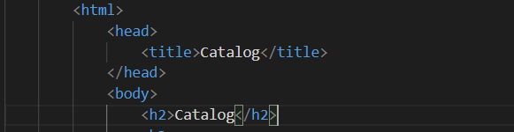
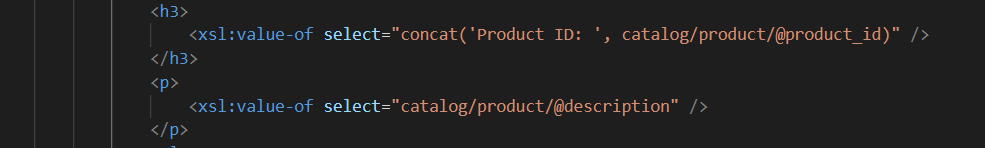
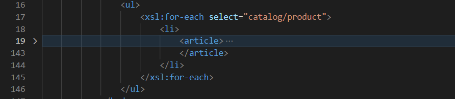
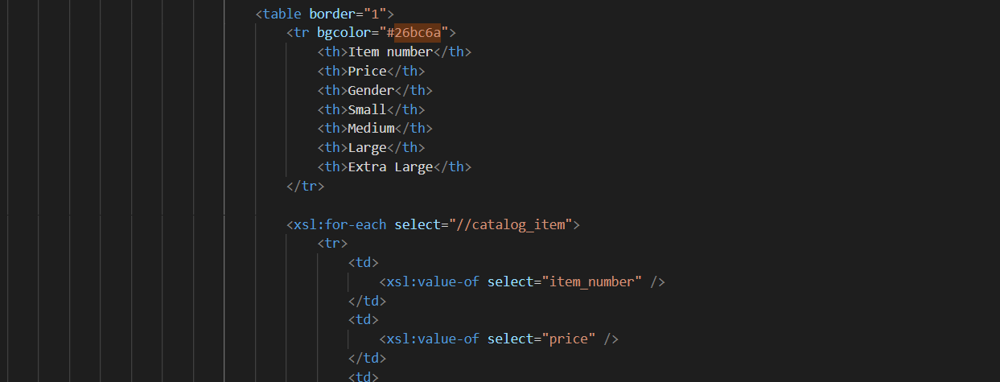
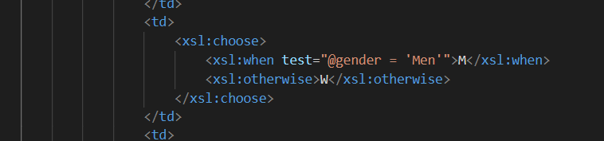
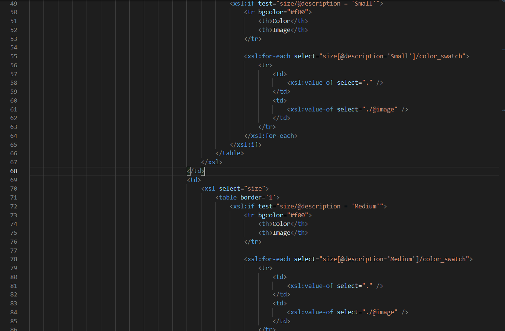
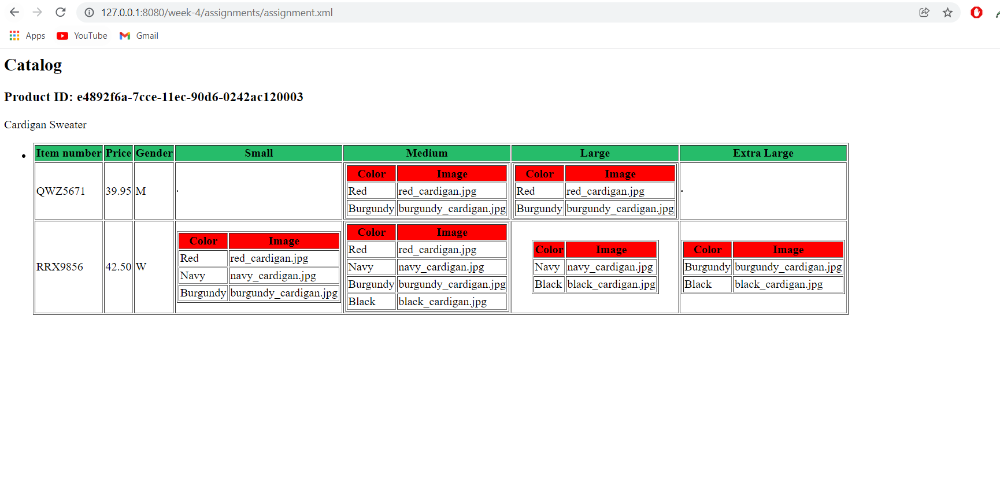

1. Added title as Catalog and also displayed Catalog as heading for the page

2. Displayed product ID as h3 and displayed product description as paragraph

3. Rendered each item as `<article>` inside list item tag

4. Rendered table of catalog items with required columns

5. For gender column rendered M for Men, W for Women

6. Added subtable inide size columns

Output

I started off by designing the html structure as per the requirements and filling off the static fields. Then I used the xsl tags to display data. Used xsl:for-each, xsl:if and xsl:when tags as well. To traverse the document, I used the // in some places and traversed from the root nodes in some other.  